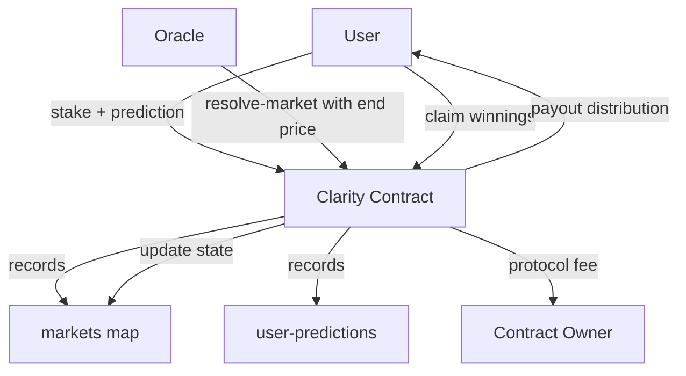

# 📊 StacksOracle Protocol

**Decentralized Prediction Protocol powered by Bitcoin security through Stacks Layer 2.**

StacksOracle enables transparent, trustless prediction markets where users can stake on asset price directions, with settlements guaranteed by oracle verification and proportional reward distribution. Built for Bitcoin-native DeFi, StacksOracle empowers predictive intelligence as a new yield frontier.

---

## 🔑 System Overview

StacksOracle leverages **Clarity smart contracts** on the **Stacks blockchain** to deliver:

* **Decentralized Prediction Markets** – permissionless creation of forecasting pools on assets.
* **Trustless Settlement** – outcomes verified by a designated oracle address.
* **Fair Reward Distribution** – winners share the total pool proportionally minus protocol fees.
* **Bitcoin Security** – protocol logic and settlement executed under Stacks’ Bitcoin-secured environment.
* **Sustainable Economics** – small configurable platform fee powers protocol operations and development.

Users interact by:

1. Joining an active market with a minimum stake.
2. Choosing a directional prediction (**up** or **down**).
3. Waiting until market resolution by oracle input.
4. Claiming proportional rewards if correct.

---

## ⚙️ Contract Architecture

The protocol is structured around **four main layers**:

### 1. **Protocol Configuration & Controls**

* Owner-controlled parameters (oracle address, platform fees, minimum stake).
* Emergency pause/resume controls.
* Fee withdrawal for protocol sustainability.

### 2. **Market Lifecycle**

* **Creation** – Owner initiates markets with asset, timeframe, and start price.
* **Participation** – Users stake STX on price direction before market end-block.
* **Resolution** – Oracle provides final price to settle outcomes.
* **Settlement** – Winners claim payouts proportionally.

### 3. **Data Structures**

* `markets` – registry of all markets and state.
* `user-predictions` – individual user commitments.
* `user-stats` – historical performance metrics (predictions, winnings, losses).

### 4. **Economic Layer**

* **Stakes** locked in contract until resolution.
* **Proportional Reward Formula**:

  ```
  grossWinnings = (userStake * totalPool) / winningPool
  netPayout     = grossWinnings - protocolFee
  ```

* **Fee Flow**: deducted automatically → transferred to protocol owner.

---

## 📐 Data Flow



---

## 🧩 Key Functions

### Market Operations

* `create-market` → Deploy new prediction market.
* `make-prediction` → Stake STX on a direction (`up`/`down`).
* `resolve-market` → Oracle finalizes outcome with end price.
* `claim-winnings` → Users withdraw winnings post-resolution.

### Queries

* `get-market-details` → Market state, pool sizes, status.
* `get-user-prediction-details` → Individual stake info.
* `get-user-stats` → Prediction history and performance.
* `get-platform-stats` → Volume, fees, contract balance.
* `get-platform-config` → Current configuration parameters.

### Administration

* `set-oracle-address` → Update oracle authority.
* `set-minimum-stake` → Adjust economic threshold.
* `set-platform-fee` → Manage fee percentage.
* `toggle-protocol-pause` → Emergency control.
* `withdraw-fees` → Collect accrued protocol fees.

---

## 📊 Analytics & Metrics

* **Total Volume** – cumulative STX locked in predictions.
* **Total Fees Collected** – protocol revenue.
* **Market Participation** – tracked per-market and per-user.
* **User Stats** – transparent track record of wins and losses.

---

## 🚀 Deployment & Usage

1. Deploy the contract to the Stacks chain.
2. Configure oracle address and fee percentage.
3. Owner creates markets → users start participating.
4. Oracle resolves → users claim rewards.

---

## 🔒 Security Considerations

* **Oracle Trust** – outcome depends on oracle integrity.
* **Paused State** – owner can halt markets in emergencies.
* **Min Stake** – prevents spam markets and low-value predictions.
* **Fee Boundaries** – enforced max fee (`10%`) for fairness.

---

## 📌 License

StacksOracle Protocol is released under **MIT License**.
